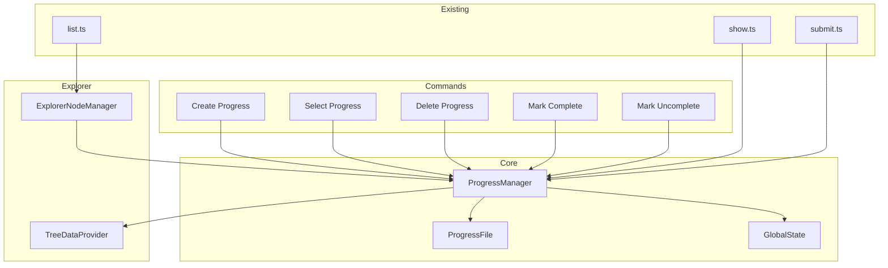

# Design Document: Progress Tracking

## Overview

本功能为 LeetCode VS Code 扩展添加本地进度追踪系统。核心思想是在工作目录下维护一个进度文件（JSON 格式），存储题目完成状态和通过的题解。当用户选中某个进度时，扩展将使用本地进度文件中的状态替代 LeetCode 远程状态来显示题目完成情况。

主要组件：
- **ProgressManager**: 管理进度的创建、删除、选择和持久化
- **ProgressFile**: 进度文件的数据结构和序列化/反序列化
- **State Resolution**: 根据是否有活动进度决定使用本地或远程状态

## Architecture



## Components and Interfaces

### 1. IProgress Interface

```typescript
interface IProgress {
    name: string;
    createdAt: string;
    problemStates: Map<string, ProblemState>;  // problemId -> state
    solutions: Map<string, ISolution>;          // problemId -> solution
}

interface ISolution {
    problemId: string;
    language: string;
    code: string;
    submittedAt: string;
}

interface IProgressFile {
    version: string;
    progress: IProgress;
}
```

### 2. ProgressManager Class

```typescript
class ProgressManager implements Disposable {
    private activeProgressName: string | undefined;
    private progressDir: string;

    // Progress CRUD
    createProgress(name: string): Promise<void>;
    deleteProgress(name: string): Promise<void>;
    listProgresses(): Promise<string[]>;

    // Active progress management
    selectProgress(name: string | undefined): Promise<void>;
    getActiveProgress(): IProgress | undefined;
    getActiveProgressName(): string | undefined;

    // Problem state management
    getProblemState(problemId: string): ProblemState;
    setProblemState(problemId: string, state: ProblemState): Promise<void>;

    // Solution management
    storeSolution(problemId: string, language: string, code: string): Promise<void>;
    getSolution(problemId: string): ISolution | undefined;

    // State resolution
    shouldUseLocalState(): boolean;
    resolveProblemState(problemId: string, remoteState: ProblemState): ProblemState;
}
```

### 3. ProgressFile Utilities

```typescript
// Serialization/Deserialization
function serializeProgress(progress: IProgress): string;
function deserializeProgress(json: string): IProgress;

// File operations
function getProgressFilePath(workspaceDir: string, progressName: string): string;
function loadProgressFile(filePath: string): Promise<IProgress>;
function saveProgressFile(filePath: string, progress: IProgress): Promise<void>;
function progressFileExists(filePath: string): Promise<boolean>;
```

### 4. Commands

新增以下命令：
- `leetcode.createProgress` - 创建新进度
- `leetcode.selectProgress` - 选择/取消进度
- `leetcode.deleteProgress` - 删除进度
- `leetcode.listProgresses` - 列出所有进度
- `leetcode.markComplete` - 标记题目为已完成
- `leetcode.markUncomplete` - 标记题目为未完成
- `leetcode.viewStoredSolution` - 查看存储的题解

## Data Models

### Progress File Structure (JSON)

```json
{
    "version": "1.0",
    "progress": {
        "name": "my-progress",
        "createdAt": "2025-12-18T10:00:00Z",
        "problemStates": {
            "1": 1,
            "2": 2,
            "15": 1
        },
        "solutions": {
            "1": {
                "problemId": "1",
                "language": "typescript",
                "code": "function twoSum(nums: number[], target: number): number[] { ... }",
                "submittedAt": "2025-12-18T10:30:00Z"
            }
        }
    }
}
```

### File Location

进度文件存储在工作目录下的 `.leetcode/progress/` 目录中：
```
workspace/
├── .leetcode/
│   └── progress/
│       ├── my-progress.json
│       └── interview-prep.json
```

### GlobalState Keys

- `leetcode.activeProgress` - 当前选中的进度名称

## Correctness Properties

*A property is a characteristic or behavior that should hold true across all valid executions of a system-essentially, a formal statement about what the system should do. Properties serve as the bridge between human-readable specifications and machine-verifiable correctness guarantees.*

### Property Reflection

After analyzing the prework, the following redundancies were identified:
- Properties 4.2 and 4.3 (mark complete/uncomplete) can be combined into a single state update property
- Properties 2.2 and 2.3 (select/deselect) can be combined into a single selection property
- Properties 5.1, 5.2, 5.3 can be combined into a solution storage round-trip property
- Properties 3.1 and 3.2 can be combined into a state resolution property

### Final Properties

**Property 1: Progress file round-trip**
*For any* valid progress data, serializing to JSON and then deserializing should produce an equivalent progress object.
**Validates: Requirements 1.4**

**Property 2: Progress creation initializes empty state**
*For any* valid progress name, creating a new progress should result in a progress file with empty problemStates and empty solutions maps.
**Validates: Requirements 1.2**

**Property 3: Duplicate progress name rejection**
*For any* existing progress name, attempting to create a progress with the same name should fail and leave the existing progress unchanged.
**Validates: Requirements 1.3**

**Property 4: Progress selection persistence**
*For any* progress name, selecting it as active and then querying the active progress should return that same name; selecting "none" should return undefined.
**Validates: Requirements 2.2, 2.3, 2.4**

**Property 5: State resolution logic**
*For any* problem ID and remote state, if an active progress exists and contains a state for that problem, the resolved state should be the local state; otherwise, it should be the remote state.
**Validates: Requirements 3.1, 3.2**

**Property 6: Problem state update persistence**
*For any* problem ID and state value, after setting the problem state in the active progress, reading the state should return the same value.
**Validates: Requirements 4.2, 4.3, 4.4**

**Property 7: Solution storage round-trip**
*For any* problem ID, language, and code string, storing a solution and then retrieving it should return the same code and language; storing a new solution should overwrite the previous one.
**Validates: Requirements 5.1, 5.2, 5.3, 5.4**

**Property 8: Solution display decision**
*For any* problem with an active progress, if the problem state is NotAC or Unknown, the system should not show web solutions; if the state is AC, the system should allow viewing stored solutions.
**Validates: Requirements 6.1, 6.2, 6.3**

**Property 9: Progress deletion removes file**
*For any* existing progress, after deletion, the progress file should not exist and listing progresses should not include it.
**Validates: Requirements 7.2**

**Property 10: Active progress cleanup on deletion**
*For any* progress that is currently active, deleting it should clear the active progress selection.
**Validates: Requirements 7.3**

**Property 11: Progress listing completeness**
*For any* set of created progresses, listing should return all progress names, and the active progress (if any) should be correctly identified.
**Validates: Requirements 8.1, 8.2**

## Error Handling

| Error Scenario | Handling Strategy |
|----------------|-------------------|
| Progress file corrupted | Show error message, offer to delete and recreate |
| Workspace folder not available | Prompt user to open a workspace folder |
| Duplicate progress name | Show error message, prevent creation |
| Progress file not found on load | Clear active progress, show warning |
| File system permission error | Show error message with details |
| Invalid progress name (empty/special chars) | Validate input, show error message |

## Testing Strategy

### Property-Based Testing Library

使用 **fast-check** 作为 TypeScript 的属性测试库。

### Test Configuration

每个属性测试运行至少 100 次迭代。

### Property-Based Tests

每个正确性属性将实现为一个属性测试：

1. **Progress file round-trip test**
   - Generate arbitrary progress data
   - Serialize and deserialize
   - Assert equality
   - Tag: `**Feature: progress-tracking, Property 1: Progress file round-trip**`

2. **Progress creation test**
   - Generate arbitrary valid progress names
   - Create progress
   - Assert empty initial state
   - Tag: `**Feature: progress-tracking, Property 2: Progress creation initializes empty state**`

3. **Duplicate name rejection test**
   - Generate progress name, create twice
   - Assert second creation fails
   - Tag: `**Feature: progress-tracking, Property 3: Duplicate progress name rejection**`

4. **Selection persistence test**
   - Generate progress names
   - Select and query
   - Assert consistency
   - Tag: `**Feature: progress-tracking, Property 4: Progress selection persistence**`

5. **State resolution test**
   - Generate problem IDs, local states, remote states
   - Test resolution logic
   - Tag: `**Feature: progress-tracking, Property 5: State resolution logic**`

6. **State update persistence test**
   - Generate problem IDs and states
   - Set and get
   - Assert equality
   - Tag: `**Feature: progress-tracking, Property 6: Problem state update persistence**`

7. **Solution round-trip test**
   - Generate solutions
   - Store and retrieve
   - Assert equality
   - Tag: `**Feature: progress-tracking, Property 7: Solution storage round-trip**`

8. **Solution display decision test**
   - Generate problem states
   - Test display decision function
   - Tag: `**Feature: progress-tracking, Property 8: Solution display decision**`

9. **Deletion removes file test**
   - Create and delete progress
   - Assert file doesn't exist
   - Tag: `**Feature: progress-tracking, Property 9: Progress deletion removes file**`

10. **Active progress cleanup test**
    - Set active, delete
    - Assert active is cleared
    - Tag: `**Feature: progress-tracking, Property 10: Active progress cleanup on deletion**`

11. **Listing completeness test**
    - Create multiple progresses
    - List and verify all present
    - Tag: `**Feature: progress-tracking, Property 11: Progress listing completeness**`

### Unit Tests

单元测试覆盖：
- Edge cases: empty progress name, special characters in name
- Error conditions: file not found, corrupted JSON
- Integration: submit solution updates progress
