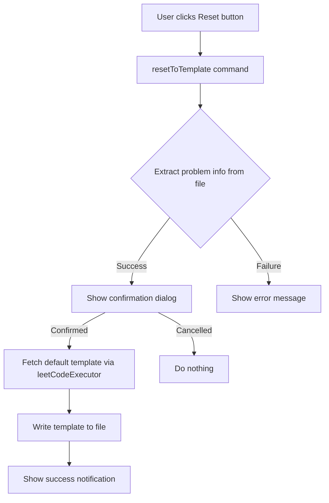

# Design Document: Reset to Template

## Overview

本功能为 VS Code LeetCode 扩展添加一个"Reset"按钮，允许用户将当前的 LeetCode 问题文件重置为默认代码模板。该功能通过 CodeLens 机制在编辑器中显示按钮，与现有的 Submit 和 Test 按钮保持一致的用户体验。

## Architecture



## Components and Interfaces

### 1. CustomCodeLensProvider (修改)

修改 `src/codelens/CustomCodeLensProvider.ts`，在 Test 按钮之后添加 Reset 按钮。

```typescript
// 在 provideCodeLenses 方法中添加
if (shortcuts.indexOf("reset") >= 0) {
    codeLens.push(new vscode.CodeLens(range, {
        title: "Reset",
        command: "leetcode.resetToTemplate",
        arguments: [document.uri],
    }));
}
```

### 2. Reset Command (新增)

新增 `src/commands/reset.ts` 文件，实现重置功能。

```typescript
interface ResetResult {
    success: boolean;
    message: string;
}

export async function resetToTemplate(uri?: vscode.Uri): Promise<void>;
```

### 3. LeetCodeExecutor (修改)

修改 `src/leetCodeExecutor.ts`，添加获取默认模板的方法。

```typescript
public async getDefaultTemplate(
    problemId: string,
    language: string,
    showDescriptionInComment: boolean
): Promise<string>;
```

### 4. Extension Registration (修改)

修改 `src/extension.ts`，注册新命令。

修改 `package.json`，声明新命令。

## Data Models

### Problem File Metadata

从文件内容中提取的问题元数据：

```typescript
interface ProblemMetadata {
    problemId: string;      // 从 @lc app=.* id=(.*) 提取
    language: string;       // 从 @lc app=.* lang=(.*) 提取
}
```

### Reset Operation Result

```typescript
interface ResetOperationResult {
    success: boolean;
    errorMessage?: string;
}
```

## Correctness Properties

*A property is a characteristic or behavior that should hold true across all valid executions of a system-essentially, a formal statement about what the system should do. Properties serve as the bridge between human-readable specifications and machine-verifiable correctness guarantees.*

### Property 1: Reset produces valid template content

*For any* valid LeetCode problem file with a problem ID and language, resetting the file SHALL produce content that contains the original problem metadata markers (`@lc app=... id=... lang=...`).

**Validates: Requirements 1.2**

### Property 2: Cancel preserves file content

*For any* file content, when the user cancels the reset confirmation dialog, the file content after cancellation SHALL be identical to the file content before the dialog was shown.

**Validates: Requirements 1.3**

### Property 3: CodeLens button ordering

*For any* CodeLens configuration that includes both "test" and "reset" shortcuts, the Reset button SHALL appear after the Test button in the returned CodeLens array.

**Validates: Requirements 2.1**

## Error Handling

| Error Scenario | Handling Strategy |
|----------------|-------------------|
| File is not a valid LeetCode problem file | Display error message: "Failed to resolve the problem id from file" |
| Network error when fetching template | Display error message with details, prompt to open output channel |
| File write permission denied | Display error message indicating file cannot be written |
| User not logged in | Prompt user to sign in (consistent with existing behavior) |

## Testing Strategy

### Property-Based Testing

使用 `fast-check` 库进行属性测试：

1. **Property 1 测试**: 生成随机的 problem ID 和 language 组合，验证重置后的内容包含正确的元数据标记
2. **Property 2 测试**: 生成随机的文件内容，模拟取消操作，验证内容不变
3. **Property 3 测试**: 生成随机的 shortcuts 配置组合，验证按钮顺序正确

### Unit Testing

1. 测试 `resetToTemplate` 命令的基本流程
2. 测试错误处理场景（无效文件、网络错误等）
3. 测试 CodeLens 按钮的正确注册

### Test Configuration

- Property-based tests: 最少运行 100 次迭代
- 每个属性测试必须标注对应的设计文档属性编号
- 格式: `**Feature: reset-to-template, Property {number}: {property_text}**`
